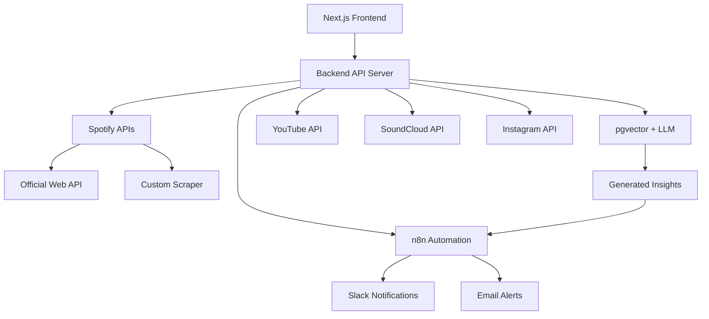

# ARTi Marketing Platform - Core Functionality Roadmap

## 🎯 **Vision Statement**
Establish the foundational backend infrastructure and communication lanes for a unified marketing intelligence platform before building application-specific abstractions.

---

## 📋 **Core Infrastructure Objectives**

### **Phase 1: Data Intelligence Foundation (Week 1)**
**Goal**: Enable intelligent data processing and retrieval using pgvector + LLM

#### **Deliverable 1.1: Vector Database Setup**
- ✅ pgvector extension enabled in Supabase
- ⏳ Document embeddings table structure
- ⏳ Vector similarity search functions
- ⏳ Embedding generation pipeline

**Acceptance Criteria:**
```sql
-- Core tables created
CREATE TABLE documents (id, org_id, source, content, metadata);
CREATE TABLE chunks (id, document_id, text, embedding vector(1536));
CREATE INDEX ON chunks USING ivfflat (embedding vector_cosine_ops);
```

#### **Deliverable 1.2: LLM Integration Backend**
- ⏳ OpenAI API integration in backend
- ⏳ Embeddings generation endpoint
- ⏳ Vector search API endpoint
- ⏳ LLM insights generation service

**API Endpoints:**
```
POST /api/embeddings/generate          - Create embeddings from text
GET  /api/search/vector?query=...      - Vector similarity search  
POST /api/insights/generate            - Generate LLM insights from data
```

---

### **Phase 2: Automation Communication Layer (Week 1-2)**
**Goal**: Establish frontend ↔ n8n communication for event-driven automation

#### **Deliverable 2.1: n8n Webhook Infrastructure**
- ⏳ Webhook endpoints in backend API
- ⏳ Event emission system
- ⏳ Frontend → n8n trigger capabilities
- ⏳ n8n → Backend callback system

**Event Flow:**
```
Frontend Action → Backend API → Event Emitted → n8n Webhook → Automation
                                              ↘ Slack/Email Notifications
```

#### **Deliverable 2.2: Core Automation Workflows**
- ⏳ Insight generation trigger workflow
- ⏳ Data sync completion notifications
- ⏳ Error/anomaly alert workflows
- ⏳ User activity automation triggers

**n8n Workflows Created:**
- `insight-generated` → Slack notification
- `sync-completed` → Email summary
- `anomaly-detected` → Admin alert
- `user-action` → Custom automation

---

### **Phase 3: Unified Platform API Layer (Week 2)**
**Goal**: Create abstracted API endpoints for all platform integrations

#### **Deliverable 3.1: Platform API Framework**
- ⏳ Generic platform interface structure
- ⏳ Rate limiting and error handling
- ⏳ Authentication management
- ⏳ Data normalization pipeline

**Core Platform Interface:**
```typescript
interface PlatformAPI {
  connect(credentials): Promise<ConnectionResult>
  fetchMetrics(params): Promise<NormalizedMetrics>
  getInsights(timeRange): Promise<PlatformInsights>
  syncData(): Promise<SyncResult>
}
```

#### **Deliverable 3.2: Spotify Integration Hub**
- ⏳ Official Spotify Web API integration
- ⏳ Custom scraper API integration (@spotify_scraper)
- ⏳ Data merging and validation
- ⏳ Unified Spotify metrics endpoint

**Spotify API Stack:**
```
/api/spotify/official/*     - Web API endpoints
/api/spotify/scraper/*      - Custom scraper endpoints  
/api/spotify/unified/*      - Merged data endpoints
```

#### **Deliverable 3.3: Platform API Stubs**
- ⏳ YouTube API integration framework
- ⏳ SoundCloud API integration framework
- ⏳ Instagram API integration framework
- ⏳ Generic "add new platform" template

---

### **Phase 4: Core Data Pipeline (Week 2-3)**
**Goal**: Establish metrics → insights → automation data flow

#### **Deliverable 4.1: Metrics Processing Pipeline**
- ⏳ Real-time data ingestion
- ⏳ Data validation and cleaning
- ⏳ Metrics normalization across platforms
- ⏳ Historical data storage optimization

**Data Flow:**
```
Platform APIs → Raw Metrics → Validation → Normalized Storage → Analytics Ready
```

#### **Deliverable 4.2: Insights Generation System**
- ⏳ Automated insights job scheduler
- ⏳ Cross-platform analytics engine
- ⏳ Anomaly detection system
- ⏳ Performance trend analysis

**Insight Types:**
- Growth metrics analysis
- Cross-platform performance comparison
- Engagement trend detection
- Revenue optimization suggestions

#### **Deliverable 4.3: Job Processing Infrastructure**
- ⏳ BullMQ job queue enhancement
- ⏳ Cron-based automation schedules
- ⏳ Job failure recovery system
- ⏳ Performance monitoring dashboard

---

## 🏗️ **Technical Architecture**

### **Core Communication Lanes**



### **API Server Structure**
```
apps/api/src/
├── routes/
│   ├── embeddings/     # Vector operations
│   ├── insights/       # LLM generation
│   ├── platforms/      # Platform APIs
│   │   ├── spotify/    # Spotify integration
│   │   ├── youtube/    # YouTube integration
│   │   └── generic/    # Platform templates
│   ├── webhooks/       # n8n communication
│   └── jobs/          # Background processing
├── services/
│   ├── vector.service.ts
│   ├── llm.service.ts
│   ├── platform.service.ts
│   └── automation.service.ts
└── workers/
    ├── insights.worker.ts
    ├── sync.worker.ts
    └── automation.worker.ts
```

---

## 📊 **Success Metrics & Acceptance Criteria**

### **Phase 1 Complete When:**
- [ ] Vector search returns relevant results in <500ms
- [ ] LLM generates insights from sample data
- [ ] Embeddings pipeline processes 1000+ records
- [ ] Vector similarity search achieves >80% accuracy

### **Phase 2 Complete When:**
- [ ] Frontend can trigger n8n workflows via API
- [ ] n8n workflows execute and callback to backend
- [ ] Slack notifications work end-to-end
- [ ] Email automation triggers successfully

### **Phase 3 Complete When:**
- [ ] Spotify official API fully integrated
- [ ] Custom scraper accessible via API
- [ ] Data validation prevents corrupt records
- [ ] All platform APIs follow consistent interface

### **Phase 4 Complete When:**
- [ ] Metrics flow from all platforms → database
- [ ] Insights auto-generate on schedule
- [ ] Anomalies trigger automated alerts
- [ ] Cross-platform analytics work correctly

---

## 🎯 **Immediate Next Steps (Week 1)**

### **Day 1-2: Vector Foundation**
1. Enhance pgvector schema in Supabase
2. Create embeddings generation service
3. Build vector search API endpoints
4. Test with sample data

### **Day 3-4: LLM Integration**
1. OpenAI API service setup
2. Insight generation workflows
3. Context building from vector search
4. LLM prompt engineering

### **Day 5-7: n8n Communication**
1. Webhook infrastructure setup
2. Event emission system
3. Basic automation workflows
4. Frontend trigger mechanisms

---

## 🔧 **Development Priorities**

### **High Priority (Foundation)**
1. **pgvector + LLM pipeline** - Core intelligence
2. **n8n webhook system** - Automation foundation  
3. **Platform API framework** - Scalable integration

### **Medium Priority (Integration)**
1. **Spotify complete integration** - First platform proof
2. **Job processing optimization** - Performance foundation
3. **Data pipeline robustness** - Reliability foundation

### **Lower Priority (Enhancement)**
1. **Additional platform stubs** - Future scalability
2. **Advanced analytics** - Business intelligence
3. **Performance optimization** - Scale preparation

---

## 🚀 **Deployment Strategy**

### **Infrastructure Requirements**
- ✅ Supabase (Database + Auth)
- ✅ Docker containers (API + Workers)
- ✅ n8n automation platform
- ⏳ OpenAI API access
- ⏳ Platform API credentials (Spotify, YouTube, etc.)

### **Environment Setup**
```bash
# Core services verification
✅ Backend API running (port 3002)
✅ Supabase stack active
✅ n8n container running (port 5678)
⏳ Vector search endpoints
⏳ LLM integration active
⏳ Platform APIs connected
```

---

## 📈 **Success Definition**

**Core Functionality Complete When:**
1. **Intelligence**: Vector search + LLM insights working
2. **Automation**: Frontend triggers n8n workflows successfully  
3. **Integration**: All platform APIs accessible via unified interface
4. **Pipeline**: Metrics → Insights → Actions flow established

**Ready for Application Development:**
- Platform-specific features can be built on top
- New platforms can be added using existing framework
- Business logic can focus on marketing intelligence
- Automation workflows can be customized per use case

---

*This roadmap establishes the foundation for scalable marketing intelligence platform development.*
