# ARTi Platform System Architecture Diagram

## High-Level System Architecture

```mermaid
graph TB
    %% User Layer
    User[👤 User Browser] --> Frontend[🎨 Next.js Frontend<br/>Vercel Deployment]
    
    %% Frontend Layer
    Frontend --> Auth[🔐 Supabase Auth<br/>JWT Validation]
    Frontend --> API[🔗 Backend API<br/>DigitalOcean]
    
    %% Backend API Layer
    API --> DB[(🗄️ Supabase Database<br/>PostgreSQL + RLS)]
    API --> Workers[⚙️ Worker System<br/>Node.js + BullMQ]
    API --> Automation[🤖 n8n Automation<br/>Workflow Engine]
    
    %% Data Layer
    DB --> CoreTables[📊 Core Tables<br/>orgs, users, campaigns]
    DB --> VectorDB[🧠 pgvector<br/>Embeddings & RAG]
    
    %% Worker System
    Workers --> Redis[(📦 Redis Queue<br/>Job Processing)]
    Workers --> Metrics[📈 Metrics Sync<br/>External APIs]
    Workers --> LLM[🤖 LLM Insights<br/>AI Analytics]
    
    %% External Integrations
    Metrics --> Spotify[🎵 Spotify API]
    Metrics --> Instagram[📸 Instagram API]
    Metrics --> YouTube[📺 YouTube API]
    Metrics --> SoundCloud[🎧 SoundCloud API]
    
    LLM --> OpenAI[🧠 LLM Provider<br/>OpenAI]
    
    %% Automation
    Automation --> Notifications[📧 Notifications<br/>Slack/Email/SMS]
    
    %% Data Flow
    Spotify --> CoreTables
    Instagram --> CoreTables
    YouTube --> CoreTables
    SoundCloud --> CoreTables
    
    VectorDB --> LLM
    LLM --> CoreTables
    CoreTables --> Automation
    
    %% Styling
    classDef userLayer fill:#e1f5fe
    classDef frontendLayer fill:#f3e5f5
    classDef backendLayer fill:#e8f5e8
    classDef dataLayer fill:#fff3e0
    classDef externalLayer fill:#fce4ec
    classDef automationLayer fill:#f1f8e9
    
    class User userLayer
    class Frontend,Auth frontendLayer
    class API,Workers backendLayer
    class DB,CoreTables,VectorDB,Redis dataLayer
    class Spotify,Instagram,YouTube,SoundCloud,OpenAI externalLayer
    class Automation,Notifications automationLayer
```



## Detailed Service Architecture


## Data Flow Architecture


## Container Architecture

```mermaid
graph TB
    subgraph "🐳 Docker Container Stack"
        subgraph "Frontend Services"
            NextJS[Next.js App<br/>Port 3000]
        end
        
        subgraph "Backend Services"
            API_Container[Node.js API<br/>Port 3002]
            Workers_Container[Worker System<br/>BullMQ + Redis]
        end
        
        subgraph "Database Services"
            Postgres[PostgreSQL<br/>Port 5432]
            Redis[Redis Queue<br/>Port 6379]
        end
        
        subgraph "Supabase Services"
            Kong[Kong Gateway<br/>Port 8000]
            Auth[GoTrue Auth<br/>Port 9999]
            Rest[PostgREST<br/>Port 3000]
            Realtime[Realtime<br/>Port 4000]
            Studio[Supabase Studio<br/>Port 54323]
        end
        
        subgraph "Automation Services"
            n8n[n8n Automation<br/>Port 5678]
        end
        
        subgraph "Proxy Services"
            Caddy[Caddy Proxy<br/>Port 8080]
        end
    end
    
    %% Service Dependencies
    NextJS --> API_Container
    API_Container --> Kong
    Kong --> Auth
    Kong --> Rest
    Kong --> Realtime
    Rest --> Postgres
    Workers_Container --> Redis
    Workers_Container --> Postgres
    n8n --> API_Container
    Caddy --> Kong
    Caddy --> n8n
    Caddy --> Studio
```



## Security Architecture


## API Endpoint Architecture

```mermaid
graph LR
    subgraph "🔗 API Endpoints"
        subgraph "Health & Monitoring"
            Health[/healthz]
            Ready[/readyz]
            Status[/api/health]
        end
        
        subgraph "Authentication"
            Auth_Me[/auth/me]
            Auth_Test[/auth/test-isolation]
            Auth_Perms[/auth/permissions]
        end
        
        subgraph "Admin Operations"
            Admin_Users[/api/admin/users]
            Admin_Create[POST /api/admin/users]
            Admin_Update[PUT /api/admin/users/:id]
            Admin_Delete[DELETE /api/admin/users/:id]
        end
        
        subgraph "Provider APIs"
            Spotify_Health[/providers/spotify/health]
            Instagram_Health[/providers/instagram/health]
            YouTube_Health[/providers/youtube/health]
            SoundCloud_Health[/providers/soundcloud/health]
        end
        
        subgraph "Webhooks"
            Webhook_Insight[POST /webhooks/insight-created]
            Webhook_External[POST /webhooks/*]
        end
    end
    
    %% API Flow
    Health --> Status
    Auth_Me --> Admin_Users
    Admin_Users --> Spotify_Health
    Webhook_Insight --> Webhook_External
```

This comprehensive documentation provides a complete overview of your ARTi Platform system architecture, including all services, functionality, API setup, domain routing, and technical specifications. The system is production-ready with full local development mirror capabilities.
